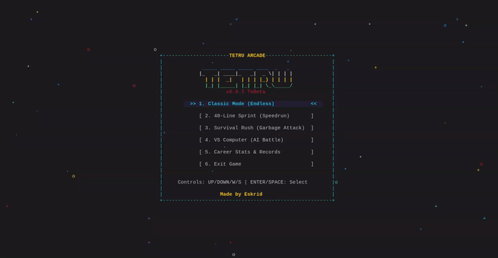

# Tetru (v0.0.3 TeBeta)

Tetru is a fast, cross-platform terminal arcade game written in pure C. It features a custom TUI engine, responsive sliding controls, multiple game modes, an adaptive AI opponent, and cryptographically verified local career stats.

Made by **Eskrid**.

---

<p align="center">
  
</p>

---

## Features

- **Cross-Platform**: Runs natively on **Linux**, **macOS**, and **Windows**.
- **Dynamic Animated TUI**: Live drifting starfield background, animated rainbow title banner, frame pulse effects, and clean borders.
- **Visual Feedback & Effects**:
  - Spark particle bursts on line clears and hard drops.
  - Screen shake on multi-line clears and incoming attacks.
  - White flash row animations.
  - Action banners for doubles, triples, Tetru quads, and combo streaks.
  - Dynamic ghost piece with color-matched outlines.
- **Multiple Game Modes**:
  1. **Classic Mode**: Endless score chase with progressive level speedups.
  2. **40-Line Sprint**: Speedrun challenge with live stopwatch tracking.
  3. **Survival Rush**: Bottom-up garbage attacks with escalating pressure.
  4. **VS Computer (AI Battle)**: Real-time duel against an AI opponent featuring attack cancelation and garbage delivery.
- **5 AI Difficulty Levels**: Beginner, Easy, Medium, Hard, and Impossible.
- **Fluid & Responsive Controls**: 7-bag randomizer, wall kicks, and a 450ms lock delay for sliding adjustments.
- **Tamper-Resistant Career Records**: Cryptographically signed local stats with keyed checksum validation and boundary verification.

---

## Controls

| Key | Action |
| --- | --- |
| `Left` / `A` | Move Left |
| `Right` / `D` | Move Right |
| `Up` / `W` | Rotate Piece (Wall Kicks enabled) |
| `Down` / `S` | Soft Drop |
| `Space` | Hard Drop |
| `C` | Hold Piece |
| `P` | Pause / Resume |
| `R` | Restart Game |
| `Q` | Return to Menu / Quit |

---

## Installation & Building

### Linux
```bash
# Debian / Ubuntu / Mint
sudo apt install build-essential libncurses-dev

# Arch Linux / Manjaro
sudo pacman -S base-devel ncurses

# Fedora / RHEL
sudo dnf install gcc make ncurses-devel

# Build & Run
make
./tetru
```

### macOS
```bash
# macOS has ncurses built-in or via Homebrew
make
./tetru
```

### Windows (MSYS2 UCRT64)
```bash
# Install toolchain + PDCurses: pacman -S mingw-w64-ucrt-x86_64-gcc mingw-w64-ucrt-x86_64-pdcurses

# Using MinGW-w64 + PDCurses (wide/UTF-8 build required by MSYS2's pdcurses package)
gcc -Wall -Wextra -O2 -DPDC_WIDE -DPDC_FORCE_UTF8 main.c -o tetru.exe -lpdcurses
.\tetru.exe

# Or simply:
make
```

---

## License

This project is licensed under the MIT License. See [LICENSE](LICENSE) for details.
